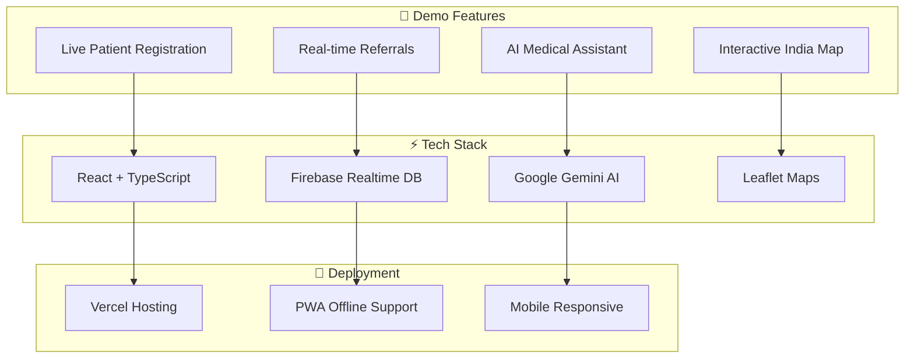

# Design Document

## Overview

MediBridge Connect is a game-changing healthcare referral platform that demonstrates how modern web technologies can solve critical healthcare challenges in rural India. Built as a Progressive Web Application (PWA) with offline-first capabilities, this system showcases the power of React, Firebase, and AI integration to create a seamless healthcare experience.

**The Problem We Solve:** Rural clinics struggle to refer patients to urban hospitals due to lack of real-time communication, bed availability information, and proper documentation systems. Patients often travel long distances only to find hospitals are full or unavailable.

**Our Solution:** A unified digital platform that connects rural clinics, urban hospitals, and patients through instant referrals, real-time bed tracking, AI-powered medical assistance, and comprehensive analytics - all working offline when internet is unreliable.

**Key Innovation:** The world's first healthcare referral system with built-in AI medical assistant, offline-first architecture, and real-time bed availability tracking specifically designed for India's diverse healthcare landscape.

## Architecture

### Demo-Ready Architecture

Our system is built for rapid deployment and impressive demonstrations, showcasing modern web development best practices:



### Technology Showcase

**Frontend Innovation:**
- ⚛️ React 18 with TypeScript for type-safe, modern development
- 🎨 Tailwind CSS + shadcn/ui for beautiful, consistent design
- 📱 PWA with offline-first architecture for rural connectivity
- 🗺️ Interactive maps with Leaflet.js for facility visualization

**Backend Excellence:**
- 🔥 Firebase for real-time data synchronization
- 🤖 Google Gemini AI for intelligent medical assistance
- 🚀 Express.js API for seamless integrations
- 📊 Real-time analytics and dashboard updates

**Deployment & Performance:**
- ⚡ Vite for lightning-fast development and builds
- 🌐 Vercel for instant global deployment
- 📱 Mobile-first responsive design
- 🔄 Automatic offline sync when connectivity returns

## Components and Interfaces

### 🎯 Core Demo Components

#### 1. Multi-Portal Dashboard System
- **Wow Factor**: Three distinct, beautifully designed portals (Clinic/Hospital/Admin)
- **Demo Impact**: Shows role-based access control and modern UI design
- **Tech Showcase**: React Router, Context API, responsive design

#### 2. Real-Time Referral System
- **Wow Factor**: Watch referrals appear instantly across different browser tabs
- **Demo Impact**: Demonstrates real-time data synchronization
- **Tech Showcase**: Firebase real-time listeners, optimistic updates

#### 3. AI Medical Assistant (MediBot)
- **Wow Factor**: Chat with AI that provides medical advice and finds hospitals
- **Demo Impact**: Shows AI integration and geolocation capabilities
- **Tech Showcase**: Google Gemini AI, geolocation API, responsive chat UI

#### 4. Interactive Healthcare Map
- **Wow Factor**: Beautiful map of India with clickable hospital markers
- **Demo Impact**: Visual representation of healthcare network
- **Tech Showcase**: Leaflet.js, custom markers, popup interactions

#### 5. Live Analytics Dashboard
- **Wow Factor**: Real-time charts and metrics that update as you demo
- **Demo Impact**: Shows data visualization and business intelligence
- **Tech Showcase**: Recharts, real-time data aggregation, responsive charts

### 🚀 Key Demo Flows

#### Flow 1: Patient Registration → Referral → Hospital Response
1. **Clinic Portal**: Register patient in 30 seconds
2. **Create Referral**: Send to hospital with urgency level
3. **Hospital Portal**: See referral appear instantly
4. **Accept & Treat**: Update status and close loop

#### Flow 2: AI Assistant Interaction
1. **Landing Page**: Click floating AI assistant
2. **Symptom Query**: "I have chest pain"
3. **AI Response**: Health advice + hospital table
4. **Location**: GPS finds nearest hospitals with directions

#### Flow 3: Real-Time Bed Tracking
1. **Hospital Dashboard**: Update bed availability
2. **Clinic View**: See changes instantly
3. **Full Hospital**: Shows "Full" status immediately
4. **Alternative Suggestions**: System suggests other hospitals

## Data Models

### 🎯 Simplified Demo-Ready Models

#### Patient Model (Minimal for Quick Demo)
```typescript
interface Patient {
  id: string;
  name: string;
  age: string;
  phone?: string;
  gender?: 'male' | 'female' | 'other';
  createdAt: Timestamp;
}
```

#### Referral Model (Core Demo Functionality)
```typescript
interface Referral {
  id: string;
  patientId: string;
  patientName: string;
  hospital: string;
  urgency: 'low' | 'medium' | 'high' | 'emergency';
  symptoms: string;
  status: 'pending' | 'accepted' | 'diagnosed' | 'closed';
  createdAt: Timestamp;
}
```

#### Hospital Model (Live Bed Tracking)
```typescript
interface Hospital {
  id: string;
  name: string;
  totalBeds: number;
  availableBeds: number;
  location: {
    latitude: number;
    longitude: number;
  };
  lastUpdated: Timestamp;
}
```

#### Chat Message Model (AI Assistant)
```typescript
interface ChatMessage {
  id: string;
  role: 'user' | 'model';
  text: string;
  timestamp: Timestamp;
  userLocation?: string;
}
```

## Correctness Properties

*Properties are the core behaviors that make our demo impressive and reliable. Each property ensures that key features work consistently across all scenarios.*

### 🎯 Core Demo Properties

### Property 1: Instant Patient Registration
*For any* valid patient data (name, age), registration should complete in under 3 seconds and generate a unique ID
**Validates: Requirements 1.1, 1.2**

### Property 2: Real-Time Referral Creation
*For any* referral with required fields, it should appear instantly in the target hospital's dashboard with "pending" status
**Validates: Requirements 2.1, 2.2**

### Property 3: Live Status Updates
*For any* referral status change, all connected users should see the update immediately without page refresh
**Validates: Requirements 2.3, 3.2**

### Property 4: Urgency-Based Queue Ordering
*For any* set of referrals with different urgency levels, the hospital queue should always show Emergency → High → Medium → Low
**Validates: Requirements 3.1**

### Property 5: Real-Time Bed Availability
*For any* bed count update, the change should reflect instantly across all clinic dashboards
**Validates: Requirements 4.1, 4.2**

### Property 6: AI Medical Response Quality
*For any* symptom query to MediBot, the response should include health advice and, when appropriate, a table of nearby hospitals
**Validates: Requirements 5.1, 5.2**

### Property 7: GPS Hospital Finding
*For any* location request, the system should use GPS to find and display the 3 nearest hospitals with Google Maps links
**Validates: Requirements 5.3, 5.4**

### Property 8: Interactive Map Functionality
*For any* healthcare facility, it should appear as a colored marker on the map with clickable popup information
**Validates: Requirements 6.1, 6.2, 6.3**

### Property 9: Live Dashboard Metrics
*For any* data change (new patient, referral, bed update), dashboard counters should update immediately
**Validates: Requirements 7.1, 7.5**

### Property 10: Role-Based Portal Access
*For any* user login, they should be redirected to the correct portal (clinic/hospital/admin) based on their role
**Validates: Requirements 8.1, 8.2**

### Property 11: Emergency Button Availability
*For any* page in the system, the emergency button should be visible and functional, providing instant access to emergency services
**Validates: Requirements 9.1, 9.2**

### Property 12: Mobile Responsiveness
*For any* screen size from mobile to desktop, all features should work perfectly with appropriate touch optimization
**Validates: Requirements 10.1, 10.2**

### Property 13: Offline Functionality
*For any* operation performed offline, data should be stored locally and sync automatically when connection returns
**Validates: Requirements 1.2, 2.2**

## Error Handling

### 🎯 Demo-Friendly Error Handling

**Network Issues (Common in Rural Areas):**
- Graceful offline mode with clear indicators
- Automatic sync when connection returns
- User-friendly "Working Offline" messages

**Form Validation:**
- Real-time validation with helpful error messages
- Clear visual feedback for required fields
- Prevention of invalid data submission

**AI Service Failures:**
- Fallback responses when Gemini AI is unavailable
- Graceful degradation with basic facility search
- Clear communication when AI features are down

**External Service Issues:**
- Backup options when Google Maps is unavailable
- Alternative location services for hospital finding
- Robust error boundaries to prevent app crashes

## Testing Strategy

### 🚀 Hackathon-Ready Testing

**Property-Based Testing with Fast-Check:**
- Minimum 100 iterations per property test
- Focus on core demo features and edge cases
- Automated testing for all critical user flows

**Demo Scenario Testing:**
- End-to-end testing of key demo flows
- Cross-browser compatibility testing
- Mobile responsiveness validation
- Real-time feature testing across multiple sessions

**Performance Testing:**
- Page load time optimization for demos
- Real-time update performance validation
- Mobile network performance testing
- Offline functionality verification

**Test Coverage Priorities:**
1. **Critical Demo Features**: Patient registration, referral creation, real-time updates
2. **AI Integration**: MediBot responses and facility finding
3. **Real-time Features**: Bed tracking, status updates, dashboard metrics
4. **Mobile Experience**: Touch interactions, responsive design, offline mode